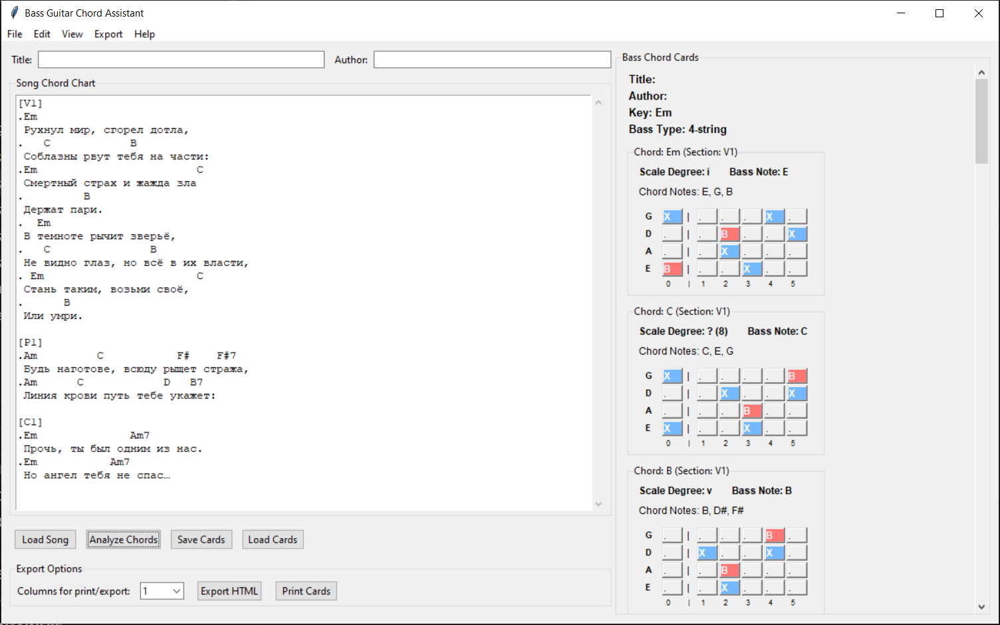
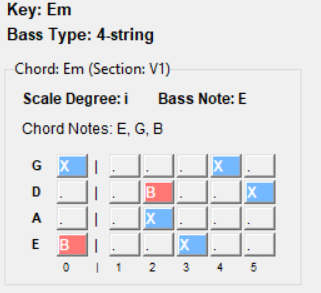
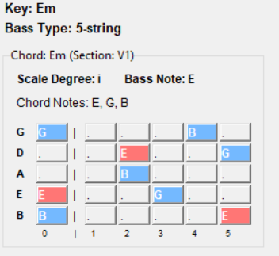
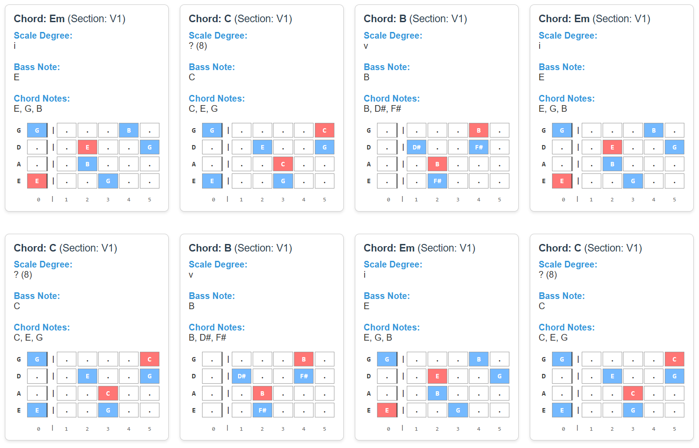

# Bass Guitar Chord Assistant



**Bass Guitar Chord Assistant** is a graphical application for analyzing musical chords and creating bass accompaniment cards with visualization of note positions on a bass guitar fretboard.

## Key Features

- 📝 Analysis of text files containing song chords
- 🎵 Automatic key detection for songs
- 🎸 Visualization of note positions on 4- and 5-string bass guitar fretboards
- 📚 Two display modes:
  - Standard mode (B/X) - for quick reading
  - Educational mode - showing names of all notes
- 💾 Save and load bass cards in YAML format
- 🌐 Export results to HTML
- 🖨️ Print cards in 1-4 column layouts on A4 paper
- 📖 Built-in HTML help documentation with formatting examples

## System Requirements

- Python 3.7 or newer
- Python libraries:
  - `tkinter` (typically included in standard Python distribution)
  - `PyYAML`
  - `collections`, `re`, `os`, `tempfile` (standard libraries)

## Installation

1. Clone the repository:
   ```bash
   git clone https://github.com/yourusername/bass-guitar-chord-assistant.git
   cd bass-guitar-chord-assistant
   ```

2. Install required dependencies:
   ```bash
   pip install PyYAML
   ```

3. Run the application:
   ```bash
   python bass_assistant_v1.py
   ```

## Song File Format

The program requires a specific file format for proper chord recognition:

- **Sections** are marked with square brackets: `[V1]`, `[Chorus]`, `[Bridge]`
- **Chord lines** must start with a dot (`.`)
- Chords in a line can be separated by spaces or tabs

### Example file:

```text
[V1]
.Em
 The world collapsed, burned to ashes,
.   C            B
 Temptations tear you apart:
.Em                        C
 Mortal fear and thirst for evil
.         B
 Are making a bet.
.  Em
 In darkness, beasts are growling,

[Chorus]
.Am         C           F#    F#7
 Be ready, the guard is prowling everywhere,
.Am      C            D   B7
 The bloodline will show you the way:
```

> **Important:** Without the dot at the beginning of chord lines, the program will not recognize them!

## User Guide

### Main Interface


1. **Top left section:**
   - Fields for entering song title and author
   - Text area for pasting or loading song text with chords

2. **Control buttons:**
   - **Load Song** — load a text file with a song
   - **Analyze Chords** — analyze chords and generate cards
   - **Save Cards** — save results in YAML format
   - **Load Cards** — load previously saved cards
   - **Export HTML** — export cards to an HTML file
   - **Print Cards** — prepare cards for printing

3. **Display settings:**
   - Display mode selection (standard or educational)
   - Bass guitar type selection (4 or 5 strings)
   - Column count selection for export/print (1-4)

4. **Right panel:**
   - Display of cards for each chord
   - Information about scale degree, bass note, and chord composition
   - Visual fretboard diagram with marked notes

### Program Menu

- **File** — file operations (load, save, exit)
- **Edit** — standard editing operations (copy, cut, paste)
- **View** — display settings (modes and bass guitar type)
- **Export** — export and print results
- **Help** — help documentation and program information

### Keyboard Shortcuts

- `Ctrl+C` — copy selected text
- `Ctrl+X` — cut selected text
- `Ctrl+V` — paste text from clipboard
- `Ctrl+A` — select all text

## Screenshots

### Standard display mode (4-string bass)


### Educational display mode (5-string bass)


### HTML export (4 columns)


## License

This project is distributed under the MIT License. See the [LICENSE](LICENSE) file for details.

## Support and Feedback

If you encounter any problems or have suggestions for improving the program, please:

- Create an issue in the GitHub repository

## Acknowledgments

- Thanks to the Python community for excellent libraries and frameworks
- Special thanks to the developers of Tkinter and PyYAML for reliable tools
